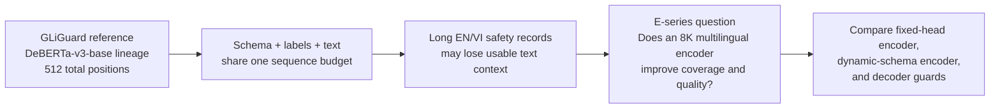
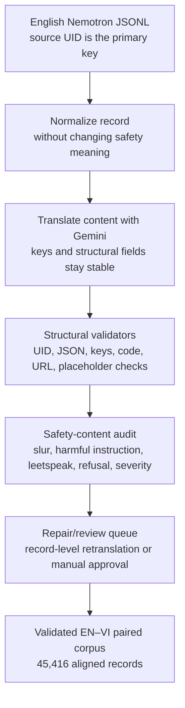
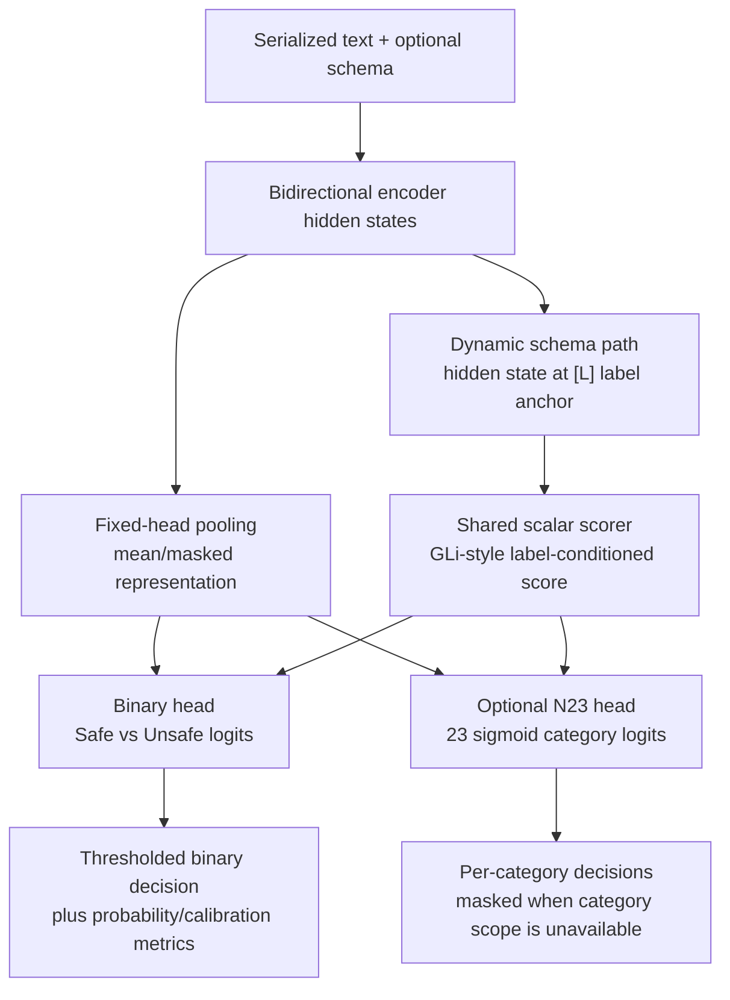
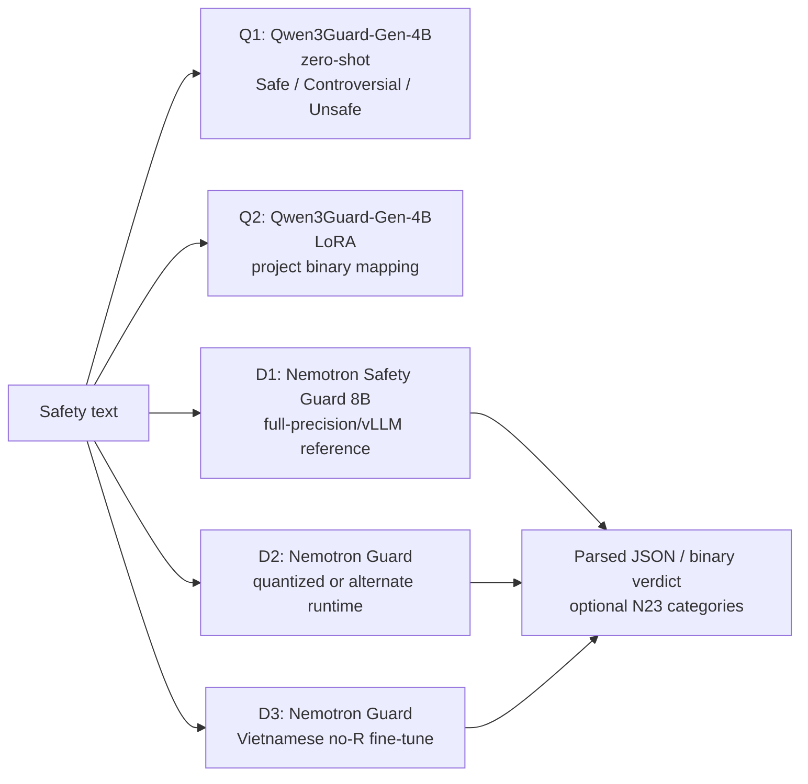

# Vietnamese Safety Guard Research: GLiGuard, 8K Encoders, and Decoder Baselines

This repository documents a research project on building and evaluating Vietnamese safety classifiers from an English Nemotron safety corpus. The project began with a practical question motivated by **GLiGuard**: can a small, non-autoregressive encoder provide useful safety decisions with lower inference cost than a much larger decoder guard?

The work then became a more specific architecture-and-data study:

> Does replacing a 512-position, English-centric DeBERTa-v3 setup with an 8K multilingual encoder improve usable context coverage and Vietnamese safety classification, and how does that encoder compare with available decoder guards?

The public repository contains the implementation, experiment contracts, validation logic, and sanitized reports. Raw safety records, translated corpora, API credentials, model weights, checkpoints, prediction dumps, and large runtime logs are intentionally excluded.

## Research at a glance

| Area | What this project established |
|---|---|
| Data | 45,416 English safety records were translated into Vietnamese with UID, schema, and content-preservation checks. |
| Translation | The Gemini translation path reached 45,416/45,416 structurally ready Vietnamese records; 478 records entered a hard review queue and were resolved or audited. |
| GLiGuard reference | The public GLiGuard checkpoint is a 0.3B schema-conditioned encoder built around a 512-position DeBERTa-v3-base lineage. |
| 8K encoder | The main alternative was `jhu-clsp/mmBERT-small`, a ModernBERT-based multilingual encoder used with an 8,192-token input contract. |
| Encoder result | The fixed-head mmBERT runs improved over the GLiGuard baseline on the matched evaluation contract; the full EN+VI run was the strongest fixed-head E-series configuration. |
| Schema result | Porting the dynamic GLiGuard-style schema head to mmBERT was technically successful but underperformed the fixed head under this first, deliberately inexpensive recipe. |
| Decoder result | Qwen3Guard-Gen-4B LoRA was strongest on the common no-response (no-R) comparison used here, while NVIDIA Nemotron Guard remained a useful large-decoder reference. |
| Main conclusion | Context capacity and multilingual exposure mattered more reliably than the first dynamic-schema implementation. Binary accuracy alone was not enough: unsafe recall, calibration, N23 category coverage, and P/PR behavior changed the deployment interpretation. |

## Why GLiGuard led to this study

The GLiGuard paper presents a schema-conditioned bidirectional encoder for safety classification. Instead of generating a moderation answer token by token, the model places task and label descriptions into the input, uses the hidden state at each label anchor, and maps those representations to classification scores. The paper reports a much smaller model and substantially higher throughput/lower latency than the decoder guards in its benchmark. See the [GLiGuard paper](https://arxiv.org/abs/2605.07982), the [official implementation](https://github.com/fastino-ai/GLiGuard), and the [released checkpoint](https://huggingface.co/fastino/gliguard-LLMGuardrails-300M).

The relevant constraint is not simply “512 tokens of user text.” The serialized sequence contains the schema, task prefix, label names/descriptions, special tokens, and the evaluated text. Every component consumes the same position budget. The 14-label and 23-label schemas are longer than the binary schema, so a multi-task safety prompt leaves less room for the underlying content.

This is especially important for Vietnamese safety data. The GLiGuard checkpoint/configuration used in the local experiments follows a `microsoft/deberta-v3-base`/512-position lineage, while the tokenizer is not a Vietnamese-focused multilingual tokenizer. Vietnamese can therefore consume a different number of subword positions than English, and the schema overhead is paid before the text is classified. The project treats this as a measurable research hypothesis—not as a claim that every Vietnamese record is automatically truncated.

### Important provenance distinction

Two similarly named research lines must not be conflated:

- **Fastino GLiGuard**, the paper/checkpoint used as the B0/E1 reference here, reports a DeBERTa-v3-base/512 released checkpoint lineage.
- A separate **GLiNER Guard** line in the local research notes discusses an mmBERT-small encoder. That is useful architectural context, but it is not evidence that the Fastino GLiGuard checkpoint used in E1 was already trained from mmBERT.

This repository therefore describes the experiment as a controlled base-model/context comparison rather than claiming that the public GLiGuard checkpoint is multilingual or that the experiment reproduces the paper exactly.

## Data and translation pipeline

### Source and target

The source is an English Nemotron safety corpus containing prompt/response safety examples, binary safety labels, and a 23-category safety taxonomy used by the multi-label evaluations. The final Vietnamese deliverable contains one translated record for every source UID.

The project result reported here is the **Gemini translation pipeline plus the completed encoder/decoder experiments**. Luna/Sol translations were completed later, but they were not used for the reported experiments and should not be presented as an experimentally validated contribution of this project.

### UID-preserving pipeline

The pipeline was designed around the following invariants:

- `UID` is the primary join key; records are never aligned by row position after translation.
- JSON keys, nesting, label fields, code blocks, URLs, placeholders, and important delimiters are protected from translation drift.
- Slurs, explicit harmful content, dangerous instructions, and obfuscated/leetspeak variants are not silently removed or softened.
- Similarity or tokenization anomalies are audit signals. A record is hard-failed only when structural or content evidence supports the failure.
- Failed records are retranslated or repaired as records, then revalidated. Human review is retained for the hard queue and for safety-sensitive content.

### Translation QA result

The validated Gemini corpus report records:

- 45,416/45,416 records structurally ready.
- 0 missing, extra, or duplicate UIDs.
- 0 unresolved hard failures.
- 45,330 direct passes plus 86 audited overrides.
- 478 records reached the hard review queue during validation.
- The report explicitly does **not** claim BLEU, COMET, or human-equivalence quality; it reports structural and safety-preservation readiness.

See the full [translation quality report](reports/final_quality/TRANSLATION_QUALITY_REPORT.md).

## Experimental contracts

The comparisons use named evaluation contracts because “accuracy before and after translation” is not a sufficient description of this study.

### R, no-R, P, and PR

Each example can be evaluated as:

- **P**: prompt-only input.
- **R**: response-only input.
- **PR**: prompt plus response context.
- **Full-R**: the original full evaluation population, including response-side records.
- **No-R**: an analysis population with response-only examples removed; P and PR remain.

The no-R analysis is useful for a cleaner prompt/paired-context comparison, but it is not the same test population as full-R. The Nemotron test set changes from 10,682 to 8,056 examples when R is removed, while SEA remains 3,680. Therefore, full-R versus no-R score differences are descriptive population differences, not a paired causal ablation.

### Native capacity and fairness

The primary E1/E2 comparison uses the same example IDs and text after eligibility filtering:

- GLiGuard: all serialized content, including schema, must fit within 512 positions.
- mmBERT: the same contract is evaluated under an 8,192-position budget.
- A secondary shared-truncated analysis exists for cases where both models must see the same truncated text.
- E3/E4/E5/E7 use the 8K path with the full available text wherever possible.

This separation prevents a long-context model from winning simply because it received more text while a short-context model saw a truncated version.

## Encoder output contracts

The encoder systems do not generate a natural-language moderation explanation. They produce fixed-size logits/probabilities that are converted into safety decisions.

### B0: GLiGuard zero-shot

B0 uses the released GLiGuard checkpoint without project-specific fine-tuning. Its architecture is schema-conditioned: label anchors provide task-specific representations, and the paper defines separate single-label and multi-label objectives plus hard composition rules for the complete moderation verdict. B0 is a zero-shot reference, not a trained Vietnamese baseline.

### E1: GLiGuard + LoRA

E1 fine-tunes the GLiGuard-style checkpoint with LoRA on the GLi-compatible binary subset. It answers: how strong is the released short-context encoder when adapted to this corpus under its native 512-position contract?

### E2–E6: fixed-head mmBERT

E2–E6 use `jhu-clsp/mmBERT-small`, a ModernBERT-based multilingual encoder with an 8,192-position configuration. The fixed-head path pools the encoder representation and attaches a binary safety head, with an optional N23 multi-label head. This is deliberately a direct classifier baseline: it tests the backbone, language exposure, and context budget without making dynamic label composition the only variable.

### E7: dynamic-schema mmBERT

E7 ports a GLiGuard-style dynamic schema interface to the 8K mmBERT backbone. The input contains task/label schema markers; the implementation scores label-anchor representations with a shared scalar head. E7 completed technically—no NaN/OOM failure and the planned steps ran—but its thresholded N23 predictions collapsed to zero in the reported run and binary performance was below the fixed-head family. This is evidence about the current training recipe and data/label contract, not proof that schema-conditioned encoders cannot work with mmBERT.

## Decoder output contracts

The decoder arm is not directly interchangeable with the encoder arm:

Q1 is a native tri-state decoder output and was mapped conservatively for binary comparison. Q2 is a LoRA-adapted Qwen output evaluated as a binary guard. D1–D3 expose a binary verdict and, where available, structured safety categories. Qwen cannot be scored as N23 in the same way unless its output contract is explicitly extended; the local reports therefore keep binary and category metrics separate.

## Experiment matrix

The locked execution plan is [`GUARD_EXPERIMENT_EXECUTION_PLAN_LOCKED_V3.md`](GUARD_EXPERIMENT_EXECUTION_PLAN_LOCKED_V3.md). The high-level question for each E-series run is:

| Run | Model / input contract | Train/evaluation question |
|---|---|---|
| B0 | GLiGuard zero-shot, 512 | How does the released schema-conditioned reference behave without adaptation? |
| E1 | GLiGuard + LoRA, 512 | Can the short-context reference adapt to the project corpus? |
| E2 | mmBERT fixed head + LoRA, 8K; same E1 IDs/text | Does a multilingual 8K encoder improve the GLi-compatible comparison? |
| E3 | mmBERT, English-only training | What is the English-only 8K baseline? |
| E4 | mmBERT, matched EN–VI training | What is the effect of adding a controlled matched Vietnamese counterpart? |
| E5 | mmBERT, full EN+VI training | Does the complete bilingual corpus improve both languages and category learning? |
| E6 | mmBERT, binary-only no-R ablation | Does removing the N23 auxiliary loss materially change the binary result? |
| E7 | mmBERT dynamic schema, 8K | Can the GLiGuard-style label-conditioned interface transfer to the 8K backbone? |

The decoder arm adds Q1/Q2 and D1/D2/D3 as model-family references, rather than treating them as interchangeable repetitions of E1–E7.

## Results: full-R encoder matrix

The table below is the headline full-R Phase 0 matrix. Values are **Nemotron accuracy / SEA accuracy**; detailed reports also contain macro-F1, safe/unsafe recall, AUROC/AUPRC, calibration, language slices, confusion matrices, and N23 metrics.

| Run | Nemotron | SEA | Interpretation |
|---|---:|---:|---|
| B0 GLiGuard zero-shot | 66.80% | 68.88% | Useful reference, but Vietnamese behavior and zero-shot calibration are weak points. |
| E1 GLiGuard + LoRA | 68.70% | 65.00% | Adaptation helps the short-context reference but does not close the gap to the 8K fixed-head path. |
| E2 mmBERT fixed head | 77.18% | 72.98% | Same common-subset IDs/text as E1; the longer multilingual backbone is the main changed factor. |
| E3 English-only mmBERT | 75.58% | 71.82% | 8K capacity alone is not the whole story; English-only training is weaker than full bilingual exposure. |
| E4 matched EN–VI mmBERT | 76.13% | 72.58% | Controlled bilingual exposure improves the bilingual operating point. |
| E5 full EN+VI mmBERT | **78.58%** | **74.13%** | Strongest fixed-head E-series configuration and the main bilingual encoder result. |
| E7 dynamic schema mmBERT | 56.13% | 54.54% | The first schema-port recipe underperformed; N23 micro-F1 was 0 at the default 0.5 threshold. |

The correct interpretation is not “8K always wins” or “dynamic schema failed.” E2 changes the backbone and context contract relative to E1; E3–E5 show the value of language exposure under a common 8K backbone; E7 changes the output architecture and training objective, so it is a diagnostic transfer experiment rather than a clean backbone ablation.

## Results: detailed no-R analysis

The no-R reports provide the deeper deployment picture. On this population, E5 achieved 78.26% Nemotron and 73.34% SEA accuracy, with Nemotron/SEA macro-F1 of 78.16%/73.00%. The language slices were 79.74%/76.79% on Nemotron EN/VI and 74.51%/72.17% on SEA EN/VI.

The important caveat is the SEA PR operating point: E5 had approximately 90.70% safe recall but only about 42.75% unsafe recall on SEA PR. A model can therefore look strong on aggregate accuracy while missing a substantial fraction of unsafe paired-context cases. For deployment, thresholds and calibration should be tuned by input contract (P versus PR), not chosen from overall accuracy alone.

The E5/E6 ablation is informative because E6 removes the N23 auxiliary loss while keeping the binary training setup, seed, LoRA rank, 8K context, and evaluation IDs aligned. E5 and E6 were statistically near-tied on binary accuracy in the no-R analysis (McNemar p-values approximately .75 on Nemotron and .92 on SEA), while E5 retained much richer category supervision. This makes the N23 head valuable for structured safety coverage even though it did not produce a large binary-accuracy gain in that run.

For N23, E5 no-R achieved micro-F1 0.3442, macro-F1 0.1576, and exact-match accuracy 44.89% at threshold 0.5. The stronger categories included Criminal Planning/Confessions, Controlled/Regulated Substances, Guns and Illegal Weapons, PII/Privacy, and Sexual. Several rare labels produced no positive predictions at that threshold even when their ranking metrics were above the frequency baseline. That pattern points to class imbalance and calibration/threshold issues, not a safe conclusion that the representation learned nothing.

E7's no-R result reinforces the architecture caveat: binary accuracy was 56.62%/48.34% on Nemotron/SEA, unsafe recall was asymmetric, and N23 remained collapsed. The run should guide a next experiment with better schema supervision, label balancing, threshold calibration, and a closer reproduction of GLiGuard's auxiliary-task/hard-composition recipe.

## Results: decoder comparison on the common no-R set

The decoder comparison uses a common 11,736-example P/PR set: 5,868 English and 5,868 Vietnamese examples, with 8,056 Nemotron and 3,680 SEA examples. These results are local subset measurements, not the official full benchmark numbers published by the model authors.

| Run | Model contract | Overall accuracy | Macro-F1 | Safe recall | Unsafe recall |
|---|---|---:|---:|---:|---:|
| Q1 | Qwen3Guard-Gen-4B zero-shot, conservative binary map | 85.15% | 84.94% | 75.85% | 93.88% |
| Q2 | Qwen3Guard-Gen-4B + LoRA | **87.83%** | **87.82%** | 87.79% | 87.87% |
| D1 | Nemotron Safety Guard 8B reference | 86.95% | 86.95% | 90.52% | 83.60% |
| D2 | Nemotron Guard alternate/quantized comparison | 86.81% | 86.81% | 89.83% | 83.97% |
| D3 | Nemotron Guard Vietnamese no-R fine-tune | 86.52% | — | 92.12% | 81.26% |

Q2 exceeded D1 by about 0.88 percentage points on this common subset, with a McNemar test of approximately p=.002. The gain was not uniform: Q2 was strong on SEA Vietnamese and overall balance, while D1 remained slightly better in some Nemotron P/PR language cells. Q2's strength is therefore best described as a balanced local binary operating point, not a universal decoder win.

The same reports show why N23 must be separated from binary results. D1 and D2 expose structured categories and have different N23 exact/micro/macro profiles; Qwen's native output in this comparison is binary and cannot be awarded an N23 score without changing its output contract.

## What the experiments say

### 1. Data and language exposure

The translation pipeline produced a usable aligned corpus, but “usable” means structurally and safety-audited—not human-perfect or automatically equivalent to native Vietnamese annotation. E3→E4→E5 is the strongest evidence that Vietnamese exposure and full bilingual coverage improve the 8K encoder operating point. The benefit appears in both languages, so it is not only a Vietnamese repair effect.

### 2. Base model and context

E1 versus E2 supports the hypothesis that a multilingual 8K encoder is a better fit for this corpus than the 512-position GLiGuard reference under the matched common-subset contract. The reason is a combination of usable context budget, tokenizer/language fit, and the capacity of the backbone—not context length in isolation.

### 3. Architecture

The fixed-head path was the practical winner in this phase. The dynamic schema port had the right conceptual interface but did not yet have the paper's full training/evaluation recipe. In particular, it differed in backbone, training duration, label/task setup, negative sampling, and auxiliary losses. E7 is therefore a valuable negative diagnostic and a clear next-step specification, not a definitive rejection of GLi-style schema conditioning.

### 4. Encoder versus decoder

The comparison is multi-objective. Encoders offer a single forward pass, compact logits, and a natural high-throughput classification interface. Decoders offer richer native output contracts and, in the Q2/D1 comparisons, stronger balanced binary performance on the local common set. The right production choice depends on latency/throughput budget, output richness, threshold behavior, and whether N23 structured categories are required.

### 5. Metrics and deployment

Overall accuracy is not sufficient for a safety guard. The reports track safe recall, unsafe recall, macro-F1, AUROC/AUPRC, calibration error, confusion matrices, language slices, P/PR slices, EN–VI agreement, and N23 per-label metrics. The most deployment-relevant failure found in the encoder analysis was not a small aggregate percentage difference; it was the mismatch between high safe recall and low unsafe recall on some SEA PR slices.

## Reproducibility and public artifact policy

The repository is organized so that a reviewer can inspect the experiment contracts without receiving sensitive safety content.

Publicly suitable material includes:

- model/input contracts and configuration files;
- translation and validation code;
- training/evaluation code;
- sanitized aggregate reports and methodology notes;
- links to upstream papers and model cards.

Intentionally excluded from the public repository:

- `API.txt`, `.env`, `auth.json`, API keys, access tokens, and private credentials;
- `data/`, translated JSONL, review queues, and raw harmful/sensitive examples;
- `models/`, model weights, LoRA adapters, and checkpoints;
- `results/`, prediction JSONL, full evaluation dumps, GPU profiles, and runtime logs;
- archives, downloaded third-party bundles, and any file that could reconstruct private data.

### Where the dataset and weights belong

GitHub is the right place for code, configuration, methodology, and sanitized aggregate evidence. It is not the right place for this project's raw safety corpus or large checkpoints.

- **Dataset:** publish only a dataset card, schema, split manifest, UID/count summary, and SHA-256 manifest in the public repository. If a release is legally and ethically approved, put the actual JSONL in a separate Hugging Face **dataset repository**, preferably private or gated, with an explicit license and access request. If the records are not approved for redistribution, keep them on controlled storage and provide no public download link.
- **Model weights:** keep the GLiGuard, mmBERT, Qwen, and Nemotron base weights at their upstream model-card locations. Put only project-owned LoRA adapters or derived checkpoints in a separate Hugging Face **model repository**, again private/gated unless redistribution and safety review are complete. Do not commit multi-hundred-megabyte `.safetensors` files to this Git repository.
- **Public GitHub link:** this repository should point to the code and evidence. It can optionally link to a gated Hugging Face dataset/model page later, but the GitHub README must remain useful even when those pages are inaccessible.

Before publishing, run a secret scan and inspect `git status --ignored`. A public CV repository should show the method and evidence trail while requiring an authorized researcher to obtain the data and weights under their own terms.

### Local setup

The code was developed on Windows with PowerShell. Install the project dependencies in a private environment, place authorized model/data paths locally, and point the configs at those paths. The configs intentionally refer to local paths such as `models/mmbert_small_base_smoke`; those weights are not part of this repository.

The main implementation areas are:

- [`guard_smoke/`](guard_smoke/) — small compatibility and architecture probes;
- [`guard_train/`](guard_train/) — fixed-head and dynamic-schema training paths;
- [`scripts/`](scripts/) — translation, training, evaluation, and audit utilities;
- [`configs/`](configs/) — locked experiment specifications;
- [`tests/`](tests/) and [`tools/`](tools/) — validation and reproducibility helpers.

## Report index

Start with these documents depending on what you want to review:

1. [CV project brief](reports/CV_PROJECT_BRIEF_NEMOTRON_GEMINI_EN_VI.md) — concise project summary and headline numbers.
2. [Detailed experiment evidence](reports/CV_DETAILED_EXPERIMENT_EVIDENCE_NEMOTRON_EN_VI.md) — full-R/no-R contracts, encoder/decoder tables, N23 details, and claim boundaries.
3. [Final encoder/Qwen/Nemotron synthesis](reports/research_archive/PROJECT_FINAL_SYNTHESIS_ENCODERS_QWEN_NEMOTRON_PUBLISHED_20260724.md) — broad research interpretation.
4. [Qwen versus D1/D2 no-R analysis](reports/research_archive/Q2_VS_Q1_D1_D2_NO_R_20260724.md) — common-set decoder comparison, slices, confusion, and N23 separation.
5. [Qwen/D2 follow-up](reports/research_archive/Q2_VS_Q1_D2_NO_R_20260724.md) — focused decoder comparison.
6. [D3 Vietnamese Nemotron analysis](reports/research_archive/D3_NEMOTRON_NO_R_FINAL_ANALYSIS_20260724.md) — Vietnamese decoder fine-tune result.
7. [E5/E6/E7 R versus no-R analysis](reports/analysis_20260724/R_VS_NO_R_E6_E7_COMPREHENSIVE_ANALYSIS_20260724.md) — the key deployment and ablation interpretation.
8. [GLiGuard/E7 provenance audit](reports/research_archive/GLIGUARD_E7_PROVENANCE_AUDIT_20260722.md) — paper/checkpoint facts and why E7 is not a faithful paper reproduction.
9. [E7 schema analysis](reports/phase0/E7_SCHEMA_ANALYSIS.md) — dynamic-schema failure analysis and next experiments.
10. [Translation quality report](reports/final_quality/TRANSLATION_QUALITY_REPORT.md) — UID, structure, safety-preservation, and review-queue evidence.

The longer local archive also contains the [original project experiment synthesis](reports/research_archive/PROJECT_EXPERIMENT_SYNTHESIS_20260722.md), [language comparison report](reports/training_dashboard/language_comparison_2026-07-22.md), and the [mmBERT/GLiGuard implementation specification](VI_GLiGuard_mmBERT_Research_Implementation_Spec_v1.md).

## Upstream references

- [GLiGuard: Schema-Conditioned Classification for LLM Safeguard](https://arxiv.org/abs/2605.07982)
- [Official Fastino GLiGuard repository](https://github.com/fastino-ai/GLiGuard)
- [Fastino GLiGuard checkpoint](https://huggingface.co/fastino/gliguard-LLMGuardrails-300M)
- [jhu-clsp/mmBERT](https://huggingface.co/jhu-clsp/mmBERT-base) and [mmBERT-small](https://huggingface.co/jhu-clsp/mmBERT-small)
- [Qwen3Guard-Gen-4B](https://huggingface.co/Qwen/Qwen3Guard-Gen-4B)
- [Llama Nemotron Safety Guard 8B v3](https://huggingface.co/nvidia/Llama-3.1-Nemotron-Safety-Guard-8B-v3)

## Project status

The Gemini-based EN→VI translation and the reported experiment suite are complete. Luna/Sol translation is outside the validated experimental scope. The next research step is not to publish stronger claims from E7; it is to reproduce the dynamic-schema recipe more faithfully, calibrate N23 thresholds per label and input contract, and compare throughput/latency on the same hardware and batch policy.
