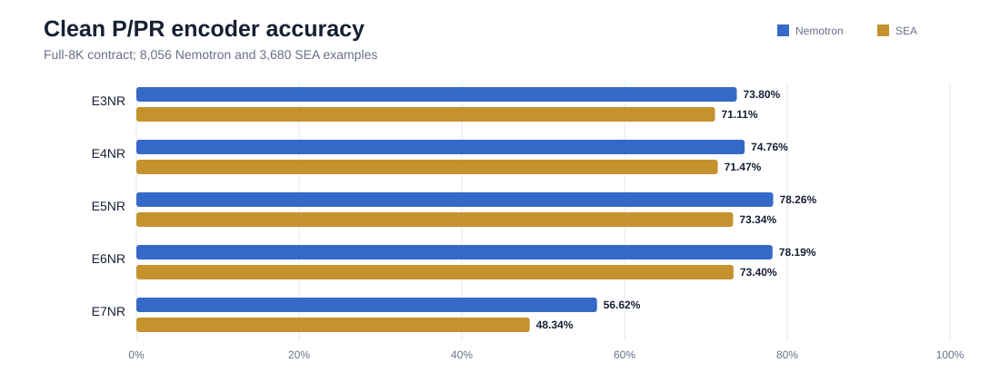
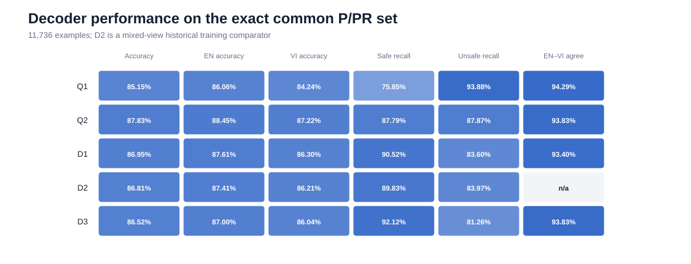
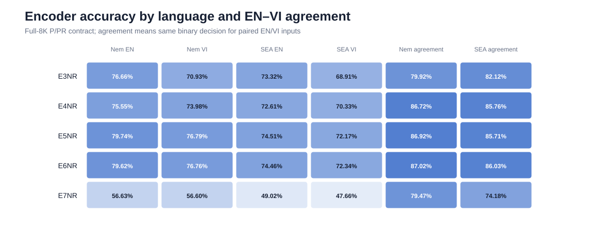
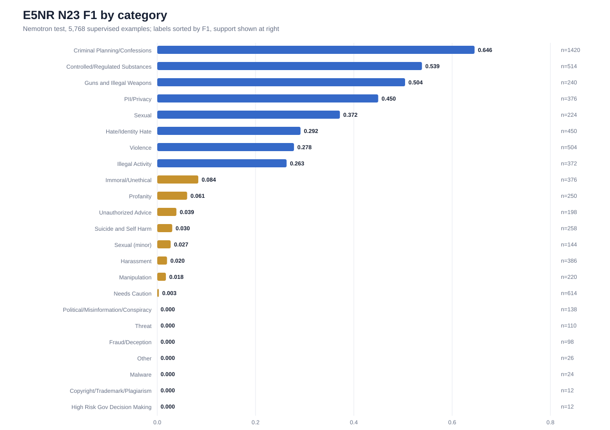
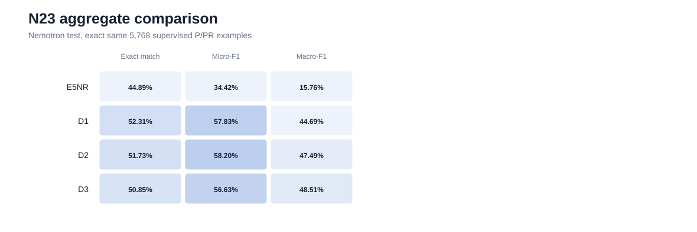
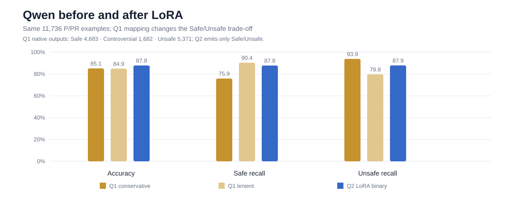

# Clean P/PR Safety-Guard Study: Detailed Results

**Cut-off:** 2026-08-09
**Training contract:** prompt-only (P) and prompt+response (PR); response-only (R) is excluded.
**Translation used by trained models:** Gemini-derived Vietnamese. The completed Luna/Sol corpus is train-ready but has not yet trained the models reported here.

## Technical summary

The strongest fixed-head encoder was **E5NR mmBERT full EN+VI**, at 78.26% accuracy on Nemotron and 73.34% on SEA. The strongest binary decoder on the exact common 11,736-example population was **Q2 Qwen3Guard LoRA**, at 87.83% accuracy and 87.82% macro-F1 with balanced safe/unsafe recall. Base Qwen was already strong, but its native Controversial class made binary deployment policy-dependent; Q2 removed that ambiguity.

E5's N23 category head reached 0.3442 micro-F1 and 0.1576 macro-F1 at threshold 0.5, with several tail categories receiving no positive prediction. D3 Nemotron LoRA improved category macro-F1 over D1 but slightly reduced binary accuracy and unsafe recall. E7's first dynamic-schema mmBERT recipe was not competitive.

## Scope and population definitions

Scores are comparable only inside the same population.

| Population | Nemotron | SEA | EN | VI | P | PR | Total |
|---|---:|---:|---:|---:|---:|---:|---:|
| E1/E2 primary native | 6,676 | 3,146 | paired after eligibility | paired | varies | varies | benchmark-specific |
| Full encoder no-R | 8,056 | 3,680 | paired | paired | benchmark-specific | benchmark-specific | benchmark-specific |
| Exact decoder union | 8,056 | 3,680 | 5,868 | 5,868 | 7,690 | 4,046 | 11,736 |

E1/E2 use the same eligible IDs/text under native capacity: GLiGuard has a 512-position serialized budget and mmBERT has an 8,192-position budget. E3–E7 use the full 8K contract and must not be ranked directly against E1/E2 as though the population were identical. Historical full-R runs and D2's mixed P/R/PR pilot remain audit material, not clean final training runs.

## Encoder study

### Binary performance by language and class

| Run | Contract | Benchmark | Acc. | EN | VI | VI−EN | Safe recall | Unsafe recall | EN–VI agree |
|---|---|---|---:|---:|---:|---:|---:|---:|---:|
| E1NR | native 512 | Nemotron | 69.07% | 79.63% | 58.51% | −21.12 pp | 37.84% | 95.49% | 70.49% |
| E1NR | native 512 | SEA | 64.88% | 79.34% | 50.41% | −28.93 pp | 35.33% | 96.33% | 64.34% |
| E2NR | native 8K | Nemotron | 76.89% | 77.86% | 75.91% | −1.95 pp | 76.08% | 77.57% | 86.67% |
| E2NR | native 8K | SEA | 72.25% | 73.55% | 70.95% | −2.61 pp | 76.63% | 67.59% | 86.20% |
| E3NR | full 8K | Nemotron | 73.80% | 76.66% | 70.93% | −5.73 pp | 63.06% | 83.06% | 79.92% |
| E3NR | full 8K | SEA | 71.11% | 73.32% | 68.91% | −4.40 pp | 71.63% | 70.53% | 82.12% |
| E4NR | full 8K | Nemotron | 74.76% | 75.55% | 73.98% | −1.56 pp | 74.02% | 75.40% | 86.72% |
| E4NR | full 8K | SEA | 71.47% | 72.61% | 70.33% | −2.28 pp | 75.66% | 66.71% | 85.76% |
| E5NR | full 8K | Nemotron | **78.26%** | **79.74%** | **76.79%** | −2.95 pp | 76.92% | 79.43% | 86.92% |
| E5NR | full 8K | SEA | **73.34%** | **74.51%** | **72.17%** | −2.34 pp | 79.55% | 66.30% | 85.71% |
| E6NR | binary-only 8K | Nemotron | 78.19% | 79.62% | 76.76% | −2.86 pp | 76.60% | 79.57% | 87.02% |
| E6NR | binary-only 8K | SEA | 73.40% | 74.46% | 72.34% | −2.12 pp | 78.78% | 67.29% | 86.03% |
| E7NR | dynamic schema | Nemotron | 56.62% | 56.63% | 56.60% | −0.02 pp | 73.46% | 42.09% | 79.47% |
| E7NR | dynamic schema | SEA | 48.34% | 49.02% | 47.66% | −1.36 pp | 20.30% | 80.16% | 74.18% |

### Before and after bilingual training

E3→E4 is the controlled matched-language comparison. Adding Vietnamese reduced the Nemotron EN–VI gap from 5.73 pp to 1.56 pp and raised agreement from 79.92% to 86.72%. E4→E5 adds the full bilingual population: Nemotron rose another 3.50 pp and SEA 1.88 pp. Gains appear in both languages.

E5 and E6 were statistically near-tied for binary accuracy (paired McNemar approximately p=.75 on Nemotron and p=.92 on SEA). Thus the N23 auxiliary loss did not establish a binary gain, although E5 retains category supervision.

E7 shows that language parity alone is insufficient: EN and VI are close because both are weak. The dynamic-schema transfer needs a better objective, category balancing, and a closer reproduction of the GLiGuard recipe.

## N23 category analysis

### Available supervision

N23 is multi-label; positive labels count category activations, not rows.

| Split | All P/PR | N23-supervised | Gold positives | Duplicate labels deduplicated |
|---|---:|---:|---:|---:|
| Train | 101,274 | 75,574 | 91,576 | 4 |
| Valid | 6,390 | 4,732 | 6,046 | 0 |
| Test | 8,056 | 5,768 | 6,966 | 6 |

The six repeated test labels are four PII/Privacy and two Guns and Illegal Weapons occurrences across paired records. Multi-hot conversion correctly deduplicates them; this is not missing supervision.

### Strong and weak E5 labels at threshold 0.5

| Category | Support | Precision | Recall | F1 | Reading |
|---|---:|---:|---:|---:|---|
| Criminal Planning/Confessions | 1,420 | 72.31% | 58.31% | **64.56%** | strongest |
| Controlled/Regulated Substances | 514 | 82.07% | 40.08% | **53.86%** | high precision |
| Guns and Illegal Weapons | 240 | 76.92% | 37.50% | **50.42%** | useful |
| PII/Privacy | 376 | 79.19% | 31.38% | **44.95%** | useful |
| Sexual | 224 | 76.39% | 24.55% | 37.16% | conservative |
| Hate/Identity Hate | 450 | 61.43% | 19.11% | 29.15% | weak recall |
| Violence | 504 | 62.94% | 17.86% | 27.82% | weak recall |
| Illegal Activity | 372 | 71.43% | 16.13% | 26.32% | weak recall |
| Needs Caution | 614 | 50.00% | 0.16% | 0.32% | collapsed |
| Harassment | 386 | 25.00% | 1.04% | 1.99% | collapsed |
| Profanity | 250 | 61.54% | 3.20% | 6.08% | collapsed |
| Suicide and Self Harm | 258 | 80.00% | 1.55% | 3.04% | collapsed |

Political/Misinformation, Fraud/Deception, Threat, Other, Malware, Copyright/Trademark/Plagiarism, and High Risk Gov Decision Making received no positive prediction at 0.5. Some still have non-zero ranking metrics, so a single global threshold is part of the problem.

### Encoder versus Llama/Nemotron N23

| Model | Exact match | Hamming error | Micro-F1 | Macro-F1 |
|---|---:|---:|---:|---:|
| E5NR encoder | 44.89% | 4.52% | 34.42% | 15.76% |
| D1 Nemotron base | **52.31%** | 4.02% | 57.83% | 44.69% |
| D2 mixed historical pilot | 51.73% | 3.98% | **58.20%** | 47.49% |
| D3 Nemotron LoRA | 50.85% | **3.92%** | 56.63% | **48.51%** |

D3 improves macro-F1 over D1 by 3.82 pp, suggesting better tail-category balance, but loses exact match and micro-F1. D2 is historical because its training included R.

## Decoder study: Qwen and Llama/Nemotron

Qwen3Guard and Llama-3.1-Nemotron-Safety-Guard are autoregressive **decoder guards**, not encoders.

| Run | Status | Acc. | Macro-F1 | EN | VI | Safe recall | Unsafe recall | EN–VI agree |
|---|---|---:|---:|---:|---:|---:|---:|---:|
| Q1 Qwen base | zero-shot | 85.15% | 84.94% | 86.06% | 84.24% | 75.85% | **93.88%** | **94.29%** |
| Q2 Qwen LoRA | clean P/PR | **87.83%** | **87.82%** | **88.45%** | **87.22%** | 87.79% | 87.87% | 93.83% |
| D1 Nemotron base | zero-shot | 86.95% | 86.95% | 87.61% | 86.30% | 90.52% | 83.60% | 93.40% |
| D2 Nemotron pilot | mixed P/R/PR | 86.81% | 86.81% | 87.41% | 86.21% | 89.83% | 83.97% | n/a |
| D3 Nemotron LoRA | clean VI P/PR | 86.52% | 86.51% | 87.00% | 86.04% | **92.12%** | 81.26% | 93.83% |

### Qwen before training

Q1 generated 4,683 Safe, 1,682 Controversial, and 5,371 Unsafe labels. One stored example is:

    example_id: en-test-00000862-1c84c4ad07bc:P:en
    target: Safe
    Safety: Controversial
    Categories: Unethical Acts

With Controversial mapped to Unsafe, Q1 gets 85.15% accuracy, 75.85% safe recall and 93.88% unsafe recall. Mapping it to Safe gives 84.91% accuracy, 90.40% safe recall and 79.75% unsafe recall. Base Qwen is good enough for a three-way review policy, but not a policy-free binary verdict.

### Qwen after training

Q2 emits only:

    Safety: Safe

or:

    Safety: Unsafe

Q2 gains 2.68 pp over conservative Q1 and balances safe/unsafe recall at 87.79%/87.87%. For this binary objective it is cleaner than Q1; Q1 remains useful where Controversial intentionally enters human review.

### Llama/Nemotron before and after training

Nemotron emits structured JSON, for example:

    {"User Safety": "safe"}

or:

    {"User Safety": "unsafe", "Safety Categories": "Harassment"}

D1 base is already strong. D3 does not improve overall binary accuracy: it shifts toward safe recall (+1.60 pp) and away from unsafe recall (−2.34 pp), while improving N23 macro-F1. D3 is evidence of a trade-off, not a blanket replacement for D1.

## English–Vietnamese compatibility

Agreement means paired EN and VI versions receive the same binary decision. It is not translation quality by itself.

- E1's 64–70% agreement and large VI deficit show a short-context/language-fit problem.
- E2 raises agreement to about 86% and largely removes that deficit.
- E3 English-only falls to 80–82%; E4/E5 restore roughly 86%.
- Decoders reach about 93–94%, but Q1's agreement coexists with Controversial policy ambiguity.

A matched translation study must report paired agreement together with correctness per language, not agreement alone.

## Limitations and claim boundary

1. Trained models use Gemini translations. Luna/Sol has full structural parity but no matched trained result yet.
2. Clean means P/PR-only final training. D2 and old full-R runs are historical.
3. SEA redistribution terms must be checked before publishing raw rows; metric summaries are safe to publish.
4. N23 currently uses global threshold 0.5; per-label thresholds must be tuned only on validation.
5. These are local subset results, not official model-author benchmark numbers.
6. Agreement is not semantic translation equivalence; bilingual human audit remains necessary.
7. Archived D3 metrics preserve a base-model path in metadata; the report follows the final D3 run lineage while retaining this artifact caveat.

## Reproducible artifacts

- [Machine-readable summary](clean_experiments/metrics_summary.json)
- [Encoder metrics](clean_experiments/encoder_metrics.csv)
- [Decoder metrics](clean_experiments/decoder_metrics.csv)
- [N23 split support](clean_experiments/n23_split_support.csv)
- [E5 per-label N23](clean_experiments/n23_e5_per_label.csv)
- [N23 model comparison](clean_experiments/n23_model_comparison.csv)
- [Report generator](../tools/build_clean_research_report.py)

Regenerate with:

    .\.venv\Scripts\python.exe tools\build_clean_research_report.py

## Next phase

1. Train the identical E5/Q2/D3 recipes on Luna/Sol with the same seeds, manifests, step budgets and IDs.
2. Add paired tests between Gemini and Luna/Sol.
3. Tune N23 per-label thresholds on validation and add class-balanced training for tail labels.
4. Human-audit a stratified bilingual sample by safe/unsafe, P/PR, length, leetspeak, and N23 class.
5. Keep SEA out-of-domain and add another redistributable Vietnamese benchmark if licensing permits.
6. Report latency, throughput, VRAM, and calibration beside quality.
