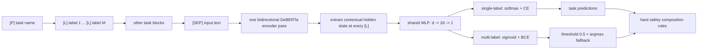

# GLiGuard / GLiNER2 provenance audit and corrected E7 diagnosis

Date: 2026-07-22

## Executive conclusion

The previous explanation that Fastino GLiGuard is strong because its encoder was
already schema-pretrained is not supported by the paper. The paper explicitly
states that the encoder is initialized from `microsoft/deberta-v3-base`, that
`[P]`, `[L]`, and `[SEP]` are added to the tokenizer, and that training runs for
20 epochs. E7 correctly implements the central `[L]`-anchor/shared-MLP idea, but
it is a much cheaper two-epoch rank-4 LoRA experiment and omits several important
training and inference mechanisms.

The result is therefore an underpowered or incomplete recipe result, not evidence
that the GLi-style architecture cannot work on mmBERT.

There is one unresolved provenance conflict: the paper names raw
`microsoft/deberta-v3-base`, whereas the current Hugging Face model metadata calls
`fastino/gliner2-base-v1` the base model. The public GLiGuard repository does not
include its training code, so neither branch can be proven from the release files
alone. Both published configs name DeBERTa-v3-base as the underlying transformer.
The earliest saved model-card revision in this audit did not contain a `base_model`
field; that field appears in a later README revision. The Hugging Face model tree is
therefore useful lineage metadata, but not independent weight-level proof that can
override the paper's explicit initialization statement.

## Three names that must not be conflated

| Name | Authors/project | Purpose | Published backbone/variant | Relationship |
|---|---|---|---|---|
| **GLiGuard: Schema-Conditioned Classification for LLM Safeguard** (`2605.07982`) | Zaratiana et al., Fastino | Dynamic-schema moderation | Paper: initialize `microsoft/deberta-v3-base`; 512 positions in released encoder config | The paper and checkpoint evaluated in B0/E1 |
| **GLiNER2** (`2507.18546`) | Zaratiana et al., Fastino | General schema-driven information extraction and classification | Public `gliner2-base-v1` config also names `microsoft/deberta-v3-base` | Library/interface and architectural line adapted by Fastino GLiGuard; a distinct task and checkpoint |
| **GLiNER Guard: Unified Encoder Family for Production LLM Safety and Privacy** (`2605.05277`) | Minko, Sadiekh, Kokuykin | Safety plus PII, three production variants | Compact uni/bi: `mmBERT-small`; Omni: mDeBERTa (`GLiNER2-Multi-v1`); max length 384 | A different paper/project released at nearly the same time; not the Fastino checkpoint used in E1 |

Thus “GLiGuard and GLiNER2 are different” is correct at the model/task/checkpoint
level. It is not correct to infer that the Fastino checkpoints necessarily use
different transformer families: their current configs both point to
DeBERTa-v3-base. The mmBERT-small claim belongs to the separate Minko et al.
GLiNER Guard compact models.

Primary links:

- Fastino GLiGuard paper: https://arxiv.org/abs/2605.07982
- Fastino GLiGuard repository: https://github.com/fastino-ai/GLiGuard
- Fastino GLiGuard checkpoint: https://huggingface.co/fastino/gliguard-LLMGuardrails-300M
- Fastino GLiNER2 repository: https://github.com/fastino-ai/GLiNER2
- Separate GLiNER Guard paper: https://arxiv.org/abs/2605.05277

## What the Fastino GLiGuard paper actually specifies

### Input and representation

- Each task begins with `[P]`, followed by a natural-language task name.
- Every candidate label is prefixed by `[L]`.
- `[SEP]` separates schema from the text.
- All three markers are added to the tokenizer and the embedding table is resized.
- Standard bidirectional self-attention jointly contextualizes task, label, and
  text tokens; no separate cross-attention module is introduced.
- The hidden state at each `[L]` position is the label representation. It is not
  the static embedding of the marker because it attends to the label string,
  task, other labels, and complete text.

This confirms that E7's decision to read every `[L]` hidden state is faithful to
the paper. Taking only the anchor position is compatible with dynamic label order
because the label text immediately following the marker affects the anchor through
bidirectional attention.

It does not guarantee robustness to arbitrary misspellings such as `SAEF` or
`UNSEFA`. Natural-language label semantics can support recomposition and some
novel labels, while badly corrupted names remove the semantic signal. Label-order
permutation is a valid contract test; arbitrary typo invariance is a separate
robustness task.

### Head and objectives

- One shared two-layer scalar scorer is applied independently to every label:
  `Linear(d, 2d) -> ReLU -> Linear(2d, 1)`.
- Single-label tasks use softmax and categorical cross-entropy.
- Multi-label tasks use independent sigmoid and binary cross-entropy.
- The classification losses are summed across tasks.
- The main paper says an entropy regularizer is added. The exact appendix
  derivation is commented out in the released TeX source, while the released
  checkpoint config records `entropy_reg_weight: 0.1`. These two facts should be
  cited separately rather than inventing an undocumented formula.

The current public GLiNER2 library is not identical to the paper recipe. In
GLiNER2 1.3.2, `Extractor._compute_sample_loss` applies BCE-with-logits to the
classification block. The Fastino GLiGuard paper explicitly distinguishes CE for
single-label tasks. This is why this project installed a single-label CE override
for E1; it was not an arbitrary deviation.

### Schema augmentations

- Shuffle candidate labels every training step.
- Independently drop labels with probability 0.15.
- Remove complete tasks with probability 0.05.

These augmentations are the paper's direct mechanism for teaching order and
subset flexibility. E7 reverses the two binary labels in only 50% of cases and
subsamples N23 negatives, but never removes a positive label and never removes a
whole task. It therefore presents a much narrower schema distribution.

### Training configuration

| Parameter | Fastino GLiGuard paper | E7 in this project |
|---|---:|---:|
| Initial encoder | `microsoft/deberta-v3-base` | mmBERT-small base |
| Maximum positions | 512 in released encoder config | 8192 |
| Encoder adaptation | Encoder LR is specified; no LoRA recipe described | LoRA rank 4, alpha 8, all-linear |
| Epochs | 20 | 2 |
| Per-device batch | 4 | 8 |
| Gradient accumulation | 2 | 4 |
| Effective batch | 8 | 32 |
| Encoder LR | `2e-5` | `1e-5` |
| Head LR | `5e-5` | `1e-4` |
| Optimizer | AdamW | AdamW |
| Weight decay | 0.01 | project default |
| Max gradient norm | 1.0 | project implementation |
| Scheduler | linear | project scheduler |
| Warmup | 10 steps, approximately 5% | project configuration |
| Label shuffle | every step | binary reversal; shuffled retained N23 labels |
| Label dropout | 0.15 | negative-only subsampling; positives retained |
| Task removal | 0.05 | none |
| Entropy regularization | yes; released config weight 0.1 | none |

### Data and inference semantics

Fastino GLiGuard trains on WildGuardTrain's human labels for prompt safety,
response safety, and refusal. GPT-4.1 supplies harm categories for unsafe
prompt/response samples and jailbreak strategies for unsafe prompts. Safe samples
receive the explicit `Benign` class without a GPT call.

For multi-label tasks, inference thresholds at 0.5 and returns the highest
probability label if nothing crosses the threshold. Prompt and response benchmark
verdicts are then composed using hard rules:

- A non-benign harm or jailbreak prediction can override prompt safety to unsafe.
- A refusal prediction can override response handling to safe.

Consequently the paper's headline harmfulness F1 is not just the raw binary
safe/unsafe head. E7 currently reports the direct binary result and direct N23
result. That is scientifically useful, but it is not an identical endpoint.

## Correct diagnosis of E7

Facts that remain valid:

- E7 completed all 8,760 optimizer steps with no NaN/OOM and verified LoRA
  gradients.
- Binary accuracy is 56.13% on full Nemotron test and 54.54% on SEA.
- Test AUROC is only about 0.605, so threshold tuning cannot close the gap.
- Reversing label order changes 22.00% of Nemotron and 33.53% of SEA decisions.
- N23 predicts zero positives at threshold 0.5; the maximum observed probability
  is 0.456.

Interpretation that is withdrawn:

- “GLiGuard wins because its encoder was already schema-pretrained.” The paper
  does not establish this.
- “A shared scalar MLP is the architectural error.” The paper uses that exact
  design successfully.

Interpretation now supported by the evidence:

- Two epochs of rank-4 LoRA are not a faithful substitute for the paper's
  20-epoch encoder optimization.
- E7 omits label dropout, task removal, entropy regularization, explicit Benign,
  multi-label fallback, refusal/jailbreak tasks, and composed decision rules.
- E7 attempts bilingual 8K Nemotron binary plus 23-category learning, a different
  and harder data regime than the published experiment.
- Negative-heavy N23 supervision may encourage low probabilities under this
  undertrained recipe, but that is a hypothesis about the complete objective,
  not a proof against the shared scorer.

## Recommended experiment order

1. **E7a binary-only:** test whether mmBERT can learn two shuffled semantic label
   anchors without N23 interference.
2. **E7b faithful recipe:** train much longer; use full encoder tuning if feasible,
   otherwise top-layer unfreezing or larger LoRA; adopt the paper's batch/LR,
   label shuffle/dropout, task removal, and released entropy weight.
3. **Faithful N23 semantics:** add `Benign`, multi-label fallback, and report raw
   binary, raw N23, and composed verdict separately.
4. **Only then extensions:** permutation-consistency loss, balanced/focal N23,
   task-conditioned `[P]+[L]` scorer, or generic multilingual schema pretraining.

These extensions may be good ideas, but they are not what the paper reports and
must not be used to retroactively explain the original GLiGuard result.

## Reproducibility files saved locally

- Paper source: `research/papers/gliguard_2605.07982/src/`
- Official Fastino GLiGuard clone: `research/sources/GLiGuard/`
- Official Fastino GLiNER2 clone: `research/sources/GLiNER2/`
- Hugging Face API/config/commit snapshots: `research/sources/huggingface/`
- Corrected E7 result report: `reports/phase0/E7_SCHEMA_ANALYSIS.md`
- Corrected decoder/E7 comparison: `reports/decoder_baseline/D1_E7_FINAL_ANALYSIS.md`
