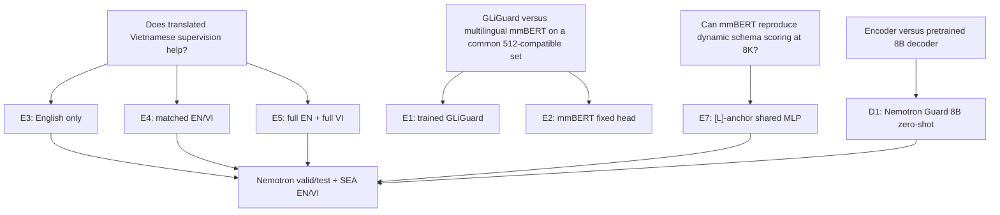

# EN-VI guardrail experiment synthesis

Snapshot date: 2026-07-22

This document is the compact research record for the completed Phase 0 encoder
experiments and the D1 decoder baseline. Raw metrics, predictions, adapters,
checkpoints, logs, and manifests remain the source of truth; this file records the
experimental contract, headline comparisons, interpretation, and recovery paths.

## Research questions

## Shared task contract

- Text views are `P` (prompt only), `R` (response only), and `PR` (prompt plus
  response). The view is metadata about which content is guarded, not a class.
- Binary safe/unsafe is single-label. Prompt and response labels are never assumed
  to be interchangeable. `PR` uses the response/interaction target defined by the
  manifest.
- N23 is an independent multi-label problem. It is supervised only when
  `category_scope` is prompt or interaction. Rows with unavailable categories are
  masked, never converted into 23 negative labels.
- EN and VI train/validation/test IDs remain paired; validation and test are not
  used as training data.
- SEA EN/VI is evaluation-only.
- Truncation is scope-aware and audited: P and R use field head+tail; PR preserves
  prompt head and response head+tail because the evaluated target is response
  safety.

## Experiment definitions

| ID | Model and purpose | Train instances | Context | Training recipe | Output |
|---|---|---:|---:|---|---|
| B0 | Released Fastino GLiGuard zero-shot | 0 | 512 | No project fine-tuning | Dynamic binary schema |
| E1 | Fastino GLiGuard trained on paired compatible EN/VI | 115,608 | 512 | 2 epochs; microbatch 8; encoder LR `1e-5`, head LR `1e-4`; single-label CE override | Dynamic binary schema |
| E2 | mmBERT-small fixed head on the same compatible set | 115,608 | up to 8K | 2 epochs; microbatch 32; gradient checkpointing; rank-4 LoRA | Binary fixed head |
| E3 | mmBERT-small English-only | 70,068 EN | up to 8K | 2 epochs; microbatch 8; effective batch 32; rank-4 LoRA; binary + masked N23 | Fixed binary + 23 logits |
| E4 | mmBERT-small matched EN/VI | 70,068 total, matched | up to 8K | Same as E3 | Fixed binary + 23 logits |
| E5 | mmBERT-small full EN + full VI | 140,136 | up to 8K | Same as E3/E4 | Fixed binary + 23 logits |
| E7 | mmBERT-small dynamic schema | 140,136 | up to 8K | 2 epochs; rank-4 LoRA; `[P]/[L]/[SEP]`; shared MLP; binary CE + dynamic N23 BCE | Dynamic schema binary + N23 |
| D1 | NVIDIA Llama-3.1 Nemotron Safety Guard 8B v3 | 0 in this project | 8K | Full FP16 zero-shot vLLM inference using official prompt/generation config | Autoregressive JSON binary + N23 |

Global encoder seed is 3407. The common LoRA recipe is rank 4, alpha 8, dropout
0, all-linear targets. AdamW, length bucketing, checkpoint resume, validation-only
threshold selection, and truncation audit are part of the locked contract.

## Comparable binary results

### Full 8K-capable evaluation

| Run | Nemotron test | EN | VI | SEA | SEA EN | SEA VI |
|---|---:|---:|---:|---:|---:|---:|
| E3 English only | 75.58% | 77.98% | 73.17% | 71.82% | 73.80% | 69.84% |
| E4 matched EN/VI | 76.13% | 77.46% | 74.80% | 72.58% | 74.08% | 71.09% |
| **E5 full EN+VI** | **78.58%** | **79.97%** | **77.20%** | **74.13%** | **75.22%** | **73.04%** |
| E7 dynamic schema | 56.13% | 56.82% | 55.44% | 54.54% | 57.61% | 51.47% |
| **D1 Nemotron Guard 8B** | **86.86%** | **87.36%** | **86.35%** | **83.91%** | **84.62%** | **83.21%** |

Main findings:

- E4 versus E3 raises Vietnamese accuracy by 1.63 points on Nemotron and 1.25
  points on SEA while narrowing the EN-VI gap. The matched bilingual data produces
  a small but repeatable cross-dataset gain.
- E5 is the best fixed encoder. It beats E4 by 2.45 points on Nemotron and 1.55
  points on SEA, showing that using all paired EN/VI data is more useful than only
  balancing a smaller sample.
- D1 is 8.28 points above E5 on Nemotron and 9.78 points above it on SEA. The SEA
  difference is stronger evidence than Nemotron because D1 was developed on the
  Nemotron dataset family.
- E7 is a failed cheap recipe, not a failed execution: all 8,760 optimizer steps
  completed, gradients were present, and no NaN/OOM occurred.

### Common GLi-compatible subset

| Run | Nemotron test | EN | VI | SEA | SEA EN | SEA VI |
|---|---:|---:|---:|---:|---:|---:|
| B0 released GLiGuard | 66.80% | 78.76% | 54.84% | 68.88% | 79.91% | 57.85% |
| E1 trained GLiGuard | 68.70% | 79.16% | 58.24% | 65.00% | 78.58% | 51.43% |
| **E2 mmBERT fixed head** | **77.18%** | 78.15% | **76.22%** | **72.98%** | 74.00% | **71.96%** |
| E5 fixed head, full EN/VI | 77.84% | **79.21%** | 76.47% | **73.84%** | **74.63%** | **73.05%** |
| E7 dynamic schema | 56.24% | 56.39% | 56.09% | 53.81% | 56.71% | 50.92% |

E1's very high Vietnamese unsafe recall does not imply better Vietnamese
understanding. Its low VI accuracy and macro-F1 show a strong unsafe prediction
bias. E2 is far more balanced and reduces the EN-VI gap to roughly two points.

## Safe/unsafe error counts for the strongest runs

Unsafe is the positive class.

### E5 on Nemotron test

| Language | Correct safe | Safe called unsafe | Unsafe called safe | Correct unsafe | Accuracy |
|---|---:|---:|---:|---:|---:|
| EN | 2,057 | 477 | 593 | 2,214 | 79.97% |
| VI | 1,990 | 544 | 674 | 2,133 | 77.20% |

### D1 on Nemotron test and SEA

| Dataset/language | Correct safe | Safe called unsafe | Unsafe called safe | Correct unsafe | Accuracy |
|---|---:|---:|---:|---:|---:|
| Nemotron EN | 2,343 | 191 | 484 | 2,323 | 87.36% |
| Nemotron VI | 2,316 | 218 | 511 | 2,296 | 86.35% |
| SEA EN | 889 | 89 | 194 | 668 | 84.62% |
| SEA VI | 873 | 105 | 204 | 658 | 83.21% |

D1 still misses unsafe examples more often than it falsely blocks safe examples.
Its Nemotron safe recall is 91.93% and unsafe recall is 82.28%; SEA safe recall is
90.08% and unsafe recall is 76.91%.

By view on Nemotron test, D1 reaches 87.46% on P, 90.18% on PR, but only 82.29%
on R. Response-only unsafe recall is 68.87%, the clearest decoder weakness and a
useful target for Vietnamese adaptation.

## N23 results

| Run | Supervised rows | Micro-F1 | Macro-F1 | Exact match | Hamming error |
|---|---:|---:|---:|---:|---:|
| E3 | 5,768 | 23.73% | 8.26% | 42.75% | 4.76% |
| E4 | 5,768 | 23.66% | 7.02% | 42.22% | 4.78% |
| E5 | 5,768 | 39.31% | 20.42% | 46.41% | 4.38% |
| E7 | 5,768 | 0.00% | 0.00% | 37.86% | 5.25% |
| **D1** | **5,768** | **57.83%** | **44.69%** | **52.31%** | **4.02%** |

D1 predicts 5,671 categories for 6,966 gold positives, giving 64.43% micro
precision and 52.45% micro recall. E5 predicts only 2,608 positives and is much
more recall-limited. E7's zero result is literal: all probabilities are below 0.5.
A validation threshold of 0.12 recovers only 21.8% micro-F1, so calibration alone
does not repair the representation.

D1 N23 by language:

| Language | Rows | Micro precision | Micro recall | Micro-F1 | Macro-F1 | Exact match | Hamming error |
|---|---:|---:|---:|---:|---:|---:|---:|
| EN | 2,884 | 65.73% | 53.20% | 58.81% | 45.87% | 52.74% | 3.91% |
| VI | 2,884 | 63.15% | 51.71% | 56.86% | 43.48% | 51.87% | 4.12% |

The Vietnamese N23 gap is small (1.95 points micro-F1 and 2.39 points macro-F1),
which supports adaptation as a refinement experiment rather than a rescue from a
nonfunctional Vietnamese baseline.

## Runtime and serving trade-off

| Run | Work measured | Runtime/throughput | Peak VRAM |
|---|---|---|---:|
| E5 | 41,414 evaluation instances across six jobs | about 106.2 examples/s | encoder profile |
| E7 | 82,828 instances across canonical/reversed jobs | about 98.6 examples/s | encoder profile |
| D1 | 23,126 autoregressive JSON evaluations including retry/fallback | about 8.35 examples/s end-to-end | 21,925 MiB |

D1 used vLLM 0.17.0, FP16, automatic prefix caching, chunked prefill, 8K model
length, and the official sampling settings: temperature 0.6, top-p 0.9, top-k 50,
maximum 100 new tokens, seed 3407. The stable continuation used 64 sequences,
8,192 batched tokens, and 92% memory utilization.

The first 128-sequence/16,384-token/94% profile was faster but OOMed on a long-tail
batch. The supervisor retained 10,640 completed predictions and resumed at the
stable settings. Future smoke tests must contain both random data and P99/Pmax
lengths; a scheduler cannot guarantee against activation peaks and fragmentation.

D1 produced valid JSON for 23,068 of 23,126 records. The 58 parse failures are
0.251%; 46 outputs used unknown category strings. Missing ratings are counted as
wrong rather than silently dropped.

## How to read the metrics

- **Accuracy:** fraction of examples classified correctly. Easy to understand but
  can hide class imbalance or an unsafe/safe bias.
- **Safe/unsafe recall:** of the true class, the fraction detected. Unsafe recall
  is especially important because a false negative passes harmful content.
- **Precision:** of examples predicted as a class, the fraction actually in that
  class. Unsafe precision falls when a guard blocks many safe inputs.
- **Macro-F1:** compute F1 separately for safe and unsafe and average them equally;
  it exposes one-class collapse better than accuracy.
- **AUPRC:** ranking quality over all thresholds, useful for the unsafe positive
  class when class balance changes. It distinguishes a bad threshold from weak
  ranking.
- **AUROC:** probability that a random unsafe example ranks above a random safe
  example. A value near 0.5 is almost random.
- **N23 micro-F1:** pool every category decision; common labels dominate.
- **N23 macro-F1:** average F1 per category; rare categories receive equal weight.
- **Exact match:** every one of the 23 category bits must match for the row.
- **Hamming error:** fraction of individual category bits that are wrong. It can
  look small because most of the 23 bits are negative.
- **Support:** number of gold examples for a class or category. A large F1 on tiny
  support is uncertain.
- **EN-VI consistency:** paired translations receive the same semantic decision.
  Consistency is not correctness; two equally wrong decisions are consistent.

## Decision summary

1. The translated Vietnamese data has demonstrated value: E4 improves VI over E3,
   and E5 is stronger still on both in-domain and SEA evaluation.
2. E5 is the current practical encoder baseline: far faster and smaller than D1,
   but roughly 8-10 accuracy points behind it.
3. D1 is the current quality leader and already transfers surprisingly well to VI,
   but has headroom in response-only unsafe recall and category recall.
4. E7 must be described as a non-faithful, low-cost GLi approximation. The corrected
   provenance and next reproduction steps are in
   `GLIGUARD_E7_PROVENANCE_AUDIT_20260722.md`.
5. The next decoder experiment should adapt D1 with train-only EN/VI data and rerun
   exactly the same D1 evaluator, allowing paired before/after analysis.

## Artifact index

- Locked plan: `configs/phase0_experiments.json`
- Language analysis: `reports/training_dashboard/language_comparison_2026-07-22.md`
- E7 analysis: `reports/phase0/E7_SCHEMA_ANALYSIS.md`
- D1/E7 final analysis: `reports/decoder_baseline/D1_E7_FINAL_ANALYSIS.md`
- D1 raw local bundle:
  `reports/vast_download/d1_nemotron_guard_8b_v3_20260722/`
- D1 prompt/generation implementation:
  `scripts/evaluate_nemotron_decoder_guard.py` and
  `scripts/evaluate_nemotron_decoder_guard_vllm.py`
- Decoder SFT length profile:
  `reports/decoder_finetune/train_prompt_length_profile.json`
- Vast recovery snapshot state:
  `D:/SafetyDataset_Backups/vast_45474443_20260722_resumable/`
